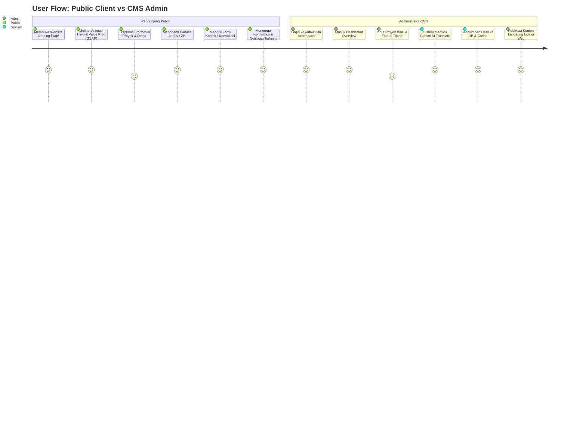
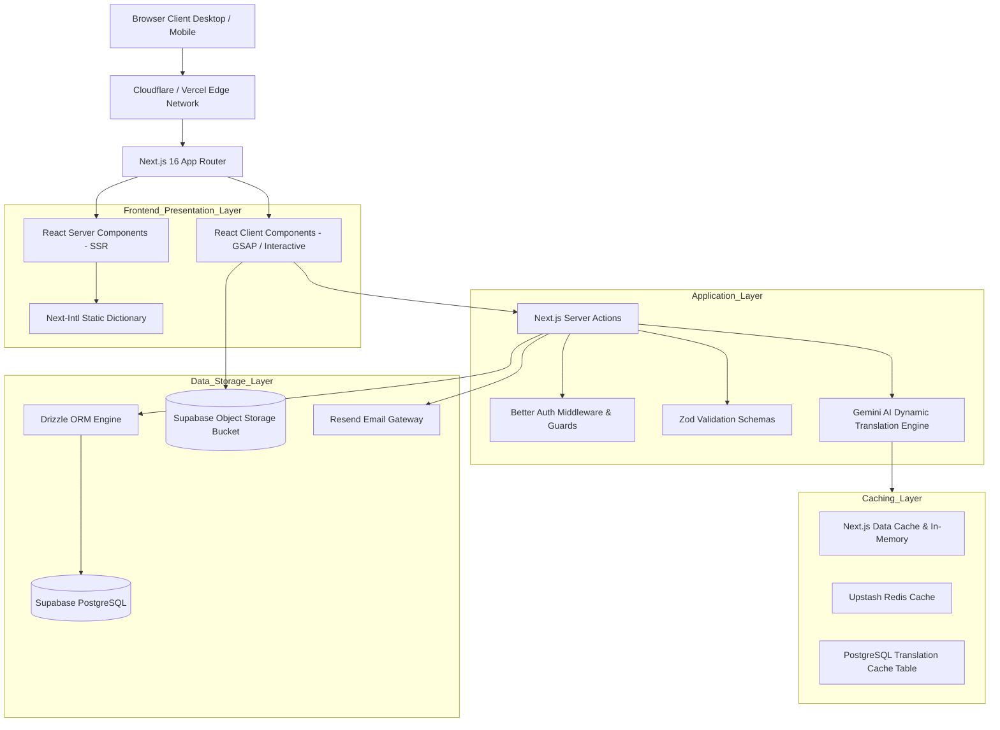
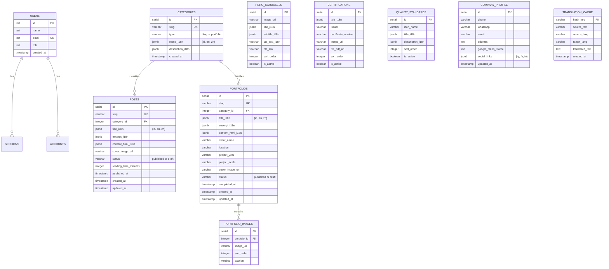
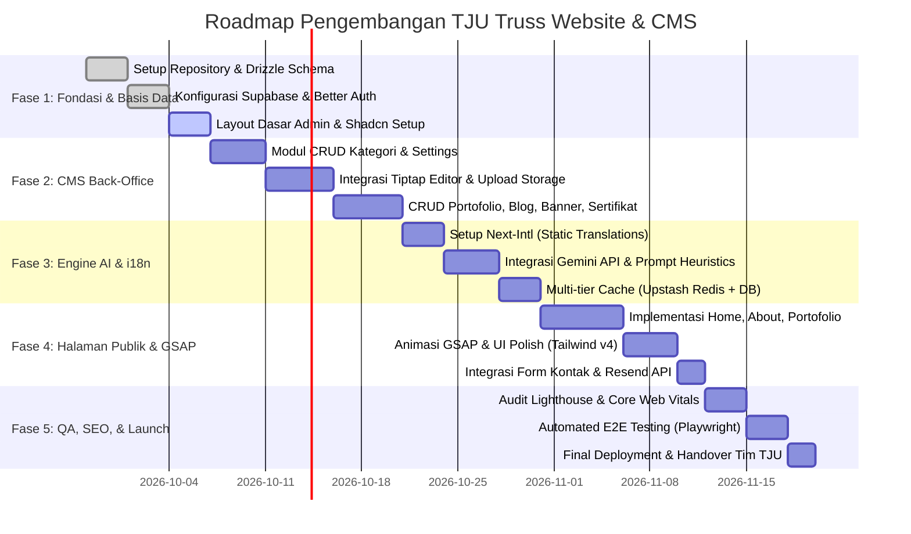

# PRODUCT REQUIREMENTS DOCUMENT (PRD)
# Website Company Profile & Dynamic CMS "TJU Truss"

---

## 1. Document Control & Metadata

| Atribut | Keterangan |
| :--- | :--- |
| **Nama Proyek** | TJU Truss Corporate Website & Content Management System (CMS) |
| **Kode Proyek** | `TJU-WEB-2026` |
| **Status Dokumen** | **Approved / Baseline Specification** |
| **Versi** | `1.0.0` |
| **Target Platform** | Web Application (Ultra-Responsive Mobile, Tablet, Desktop) |
| **Arsitektur Dasar** | Next.js 16 App Router (React 19) + SaktiTemp Foundation |
| **Target Bahasa** | Tri-lingual: Bahasa Indonesia (ID - Default), English (EN), Mandarin/Chinese (ZH) |

---

## 2. Executive Summary & Business Objectives

### 2.1. Latar Belakang & Problem Statement
PT/CV TJU Truss adalah penyedia jasa konstruksi, fabrikasi, dan instalasi rangka atap baja ringan (*truss*), kanopi, serta konstruksi struktural terkait. Selama ini, pemasaran perusahaan mengandalkan pendekatan konvensional (*word-of-mouth* dan rujukan langsung).

**Tantangan yang Dihadapi:**
1. **Ketiadaan Validasi Digital:** Calon klien bernilai tinggi (B2B developer, kontraktor utama, pemilik gedung komersial, maupun residensial premium) membutuhkan portofolio terverifikasi, sertifikasi legalitas, dan standar kualitas yang dapat diakses secara instan 24/7.
2. **Keterbatasan Jangkauan Geografis:** Pasar potensial luar daerah dan investor internasional tidak terjangkau tanpa adanya platform multi-bahasa yang terindeks secara optimal di mesin pencari (SEO).
3. **Ketergantungan Teknis Konten:** Pembaruan proyek, layanan, dan dokumentasi sering tertunda karena ketiadaan CMS mandiri yang ramah pengguna dan aman.

### 2.2. Tujuan Proyek (Business Goals)
1. **Membangun Otoritas & Kepercayaan Kredibel (Brand Trust):** Menyajikan profil korporat berkelas tinggi dengan visual modern, studi kasus portofolio mendalam, sertifikasi mutu, dan standar keselamatan kerja (K3/SNI).
2. **Ekspansi Pasar Domestik & Internasional:** Menghadirkan kapabilitas multi-bahasa otomatis (ID, EN, ZH) untuk menangkap pencarian dari korporasi multinasional dan ekspatriat.
3. **Otomatisasi & Efisiensi Operasional Tim:** Memberikan CMS intuitif dengan Tiptap Rich Text Editor dan translasi otomatis bertenaga Gemini AI, memangkas waktu publikasi konten hingga 80% tanpa perlu staf penerjemah manual.
4. **Lead Generation & Konversi Cepat:** Memudahkan calon klien mengajukan RFQ (*Request for Quotation*) atau konsultasi melalui formulir kontak terintegrasi email notifikasi langsung (Resend).

### 2.3. Key Performance Indicators (KPIs)
* **SEO & Core Web Vitals:** Skor Google Lighthouse > 85 pada metrik Performance, Accessibility, Best Practices, dan SEO di perangkat Mobile & Desktop.
* **Waktu Muat (LCP):** Largest Contentful Paint < 2.0 detik pada koneksi 4G standar.
* **Efisiensi Penerjemahan Konten:** 100% konten artikel/portofolio baru otomatis tersedia dalam EN dan ZH dalam kurun < 5 detik setelah publikasi berkat pipeline Gemini Flash + Caching.
* **Lead Conversion:** Peningkatan lead masuk dari form kontak dan tombol CTA WhatsApp.

---

## 3. Target Pengguna (User Personas & Journeys)

### 3.1. User Personas

#### Persona 1: Calon Klien Publik (Public Visitor)
* **Profil:** Pemilik properti pribadi (residensial), manajer proyek pengembang properti (commercial/B2B), arsitek, dan kontraktor umum.
* **Kebutuhan:**
  * Mencari bukti hasil pekerjaan nyata (spesifikasi bahan, durasi, lokasi proyek, foto resolusi tinggi).
  * Mengetahui legalitas, sertifikasi baja/truss yang digunakan, serta garansi struktural.
  * Navigasi lancar, cepat dibuka di smartphone saat di lapangan, dan konten tersedia dalam bahasa yang dipahami (ID/EN/ZH).
  * Menghubungi representatif TJU Truss secara cepat tanpa hambatan pendaftaran akun.

#### Persona 2: Administrator & Tim Marketing (Internal Team)
* **Profil:** Staf operasional, estimator, atau marketing TJU Truss.
* **Kebutuhan:**
  * Login aman dengan proteksi session modern.
  * Mengunggah dokumentasi proyek portofolio baru beserta spesifikasinya.
  * Menulis artikel edukatif dan berita berkala dengan formatting lengkap (heading, list, gambar tersemat, tabel).
  * Cukup menginput dalam Bahasa Indonesia, sistem secara pintar menerjemahkan ke Bahasa Inggris dan Mandarin secara instan.
  * Mengatur banner carousel, sertifikat baru, nomor kontak, dan status tayang (*Publish / Unpublished*).

### 3.2. End-to-End User Journey



---

## 4. Tumpukan Teknologi (Tech Stack & Foundation)

| Layer | Teknologi | Versi / Spesifikasi | Rationale & Fungsi |
| :--- | :--- | :--- | :--- |
| **Core Framework** | **Next.js** | `16.3.4` (App Router) | React Server Components (RSC), Server Actions, performa rendering optimal, route handlers modern. |
| **UI Library** | **React** | `19.2.8` | Compiler terintegrasi, dynamic hooks, concurrency render. |
| **Styling** | **Tailwind CSS v4** + **Shadcn UI** | `@tailwindcss/postcss ^4` | Styling performan dengan zero-runtime overhead, komponen aksesibel dan konsisten. |
| **Micro-Animations** | **GSAP (GreenSock)** | `^3.15.0` | Animasi transisi kelas industri untuk hero banner, stagger cards, scroll triggers. |
| **Database** | **Supabase (PostgreSQL)** | Hosted Postgres 15+ | Database relasional ACID-compliant, scalable, terintegrasi baik dengan Drizzle. |
| **Object Storage** | **Supabase Storage** | S3-Compatible Bucket | Penyimpanan gambar/dokumen portofolio & sertifikasi terkompresi dengan CDN bawaan. |
| **ORM** | **Drizzle ORM** | `^1.0.0-rc.4` + `drizzle-kit` | Type-safety penuh, migrasi skema SQL terstruktur, overhead memori ultra-rendah. |
| **Authentication** | **Better Auth** | `^1.7.3` | Autentikasi modern berbasis session cookie terenkripsi, RBAC, aman dari CSRF. |
| **Caching Engine** | **Multi-tier (Redis & DB)** | Upstash Redis + DB Cache | Mengeliminasi over-fetching dan meminimalkan latensi API/Database. |
| **AI Translation** | **Google Gemini API** | `@google/genai ^2.21.0` (Gemini 2.5/Flash) | Terjemahan dinamis cerdas multi-bahasa dengan sistem heuristik preservasi tag HTML. |
| **Email Service** | **Resend** | `^6.26.0` | Pengiriman notifikasi email formulir kontak dengan keterandalan tinggi. |
| **Rich Text Editor** | **Tiptap** | `^3.31.3` (Starter Kit + React) | Headless WYSIWYG editor modular yang menghasilkan semantic HTML bersih. |
| **Schema Validation**| **Zod** | `^4.5.4` | Validasi skema input data teks, URL, dan upload file secara menyeluruh. |
| **Internationalization** | **Next-Intl** | Native App Router i18n | Manajemen lokalisasi antarmuka statis (*routing*, navigasi, tombol, footer). |

---

## 5. Arsitektur Sistem & Data Flow

### 5.1. Layered Modular Architecture



### 5.2. Multi-Tier Hybrid i18n Pipeline

Sistem membedakan secara tegas dua domain translasi:
1. **Static UI Translation (Next-Intl):**
   * Disimpan dalam file kamus JSON lokal (`messages/id.json`, `messages/en.json`, `messages/zh.json`).
   * Menangani navigasi, footer, tombol CTA, placeholder input, teks hak cipta, dan label statis lainnya.
   * Diproses langsung pada saat render di server (*zero runtime API cost*).

2. **Dynamic Content Translation (Gemini Flash AI + Caching):**
   * Menangani konten dinamis dari CMS (Judul Proyek, Deskripsi Portofolio, Isi Artikel Tiptap, Kategori, Tagline Sertifikat).
   * **Pipeline Translasi:**
     ```mermaid
     sequenceDiagram
         autonumber
         actor Admin as Administrator
         participant CMS as CMS Action
         participant Heuristic as HTML Pre-processor
         participant Redis as Upstash Redis / DB Cache
         participant Gemini as Gemini Flash API
         participant DB as Supabase PostgreSQL

         Admin->>CMS: Submit Konten (ID)
         CMS->>Heuristic: Ekstraksi Text & Sanitasi Tag HTML
         CMS->>Redis: Cek Cache Hash Konten (ID -> EN, ZH)
         alt Cache Hit
             Redis-->>CMS: Return Terjemahan Tersimpan
         else Cache Miss
             CMS->>Gemini: Request Batch Translation (JSON Schema + System Instruction)
             Gemini-->>CMS: Return { en: "...", zh: "..." }
             CMS->>Redis: Set Key Cache (TTL = Permanent / Invalidate on Edit)
         end
         CMS->>DB: Simpan Konten Versi ID, EN, ZH ke Database
         CMS-->>Admin: Sukses Publikasi (Tersedia dalam 3 Bahasa)
     ```

### 5.3. Strategi Optimasi Biaya & Performa Gemini AI
Untuk menjamin efisiensi biaya dan reliabilitas tinggi:
1. **Model Selection:** Menggunakan `gemini-2.5-flash` yang memiliki rasio *cost-to-speed* dan pemahaman bahasa Asia (khususnya Mandarin teknik) paling efisien.
2. **Deterministic Hashing:** Setiap teks masukan di-hash menggunakan SHA-256 (`hash(text + target_lang)`). Jika hash sudah ada di cache, API call Gemini tidak dijalankan.
3. **Structured Batching:** Dalam satu entity (misal: 1 proyek memiliki field `title`, `excerpt`, `content_html`, `client_name`), seluruh field digabung dalam 1 *payload request JSON* ke Gemini, bukan multiple HTTP calls.
4. **HTML Preservation Heuristics:**
   * Tiptap menghasilkan tag seperti `<p>`, `<strong>`, `<ul>`, `<li>`, `<a>`, ``.
   * Prompt dilengkapi aturan ketat: *“You are a professional construction & architectural translator. Preserve ALL HTML tags, attributes, and image URLs intact. Translate only inner text contents. Output format must strictly match input structure.”*
5. **Context Caching:** Untuk istilah teknis konstruksi (contoh: *Cold-formed steel, C-truss, Reng, Zinc-Aluminium coated, Galvalum, Baut Dynabolt, Beban Angin / Wind Load*), glosarium perusahaan dimuat dalam *system instruction* agar hasil translasi seragam dan tidak terdistorsi.

---

## 6. Kebutuhan Sistem Terperinci (Functional Requirements)

### 6.1. Halaman Publik (Front-End)

| Modul / Halaman | Deskripsi Fitur & Spesifikasi | Elemen & Interaktivitas |
| :--- | :--- | :--- |
| **Global Layout** | Header, Navbar Sticky, Language Switcher (ID / EN / ZH), Footer Komprehensif. | * Flag icon dropdown.<br>* Quick links ke seluruh layanan & kontak.<br>* WhatsApp floating widget. |
| **Home (Landing Page)** | Representasi utama kapabilitas dan reputasi TJU Truss. | * **Hero Banner:** Carousel foto proyek unggulan dengan GSAP stagger effect & headline dinamis.<br>* **Value Proposition:** 4 pilar (Keandalan Struktur, Presisi Fabrikasi, Garansi Material, Kecepatan Kerja).<br>* **Quality Standard Snippet:** Cuplikan sertifikasi SNI/ISO dan metode kerja.<br>* **Featured Portfolios:** Grid proyek terbaik dengan badge kategori.<br>* **CTA Section:** Banner ajakan konsultasi/penawaran harga langsung. |
| **About Us** | Profil mendalam, sejarah, visi misi, dan legalitas. | * Cerita latar belakang perusahaan TJU Truss.<br>* Visi & Misi perusahaan.<br>* Struktur kepemimpinan & tenaga ahli bersertifikat.<br>* Grid sertifikasi legalitas usaha & uji tarik baja ringan. |
| **Portfolio & Detail** | Galeri proyek konstruksi dan rangka atap baja ringan. | * **Filter Kategori:** Residensial, Komersial, Industri, Kanopi, Fasilitas Umum.<br>* **Search & Pagination:** Pencarian berdasarkan nama proyek atau kota.<br>* **Detail Proyek:** Hero gambar, ringkasan spesifikasi (Luas Area, Tipe Baja, Waktu Pengerjaan, Klien), galeri foto sebelum-sesudah (*before-after* slider), dan artikel deskripsi proyek. |
| **Blog / News & Detail** | Pusat artikel edukasi teknik, tren konstruksi, dan update perusahaan. | * Filter kategori artikel.<br>* Estimasi waktu baca (*reading time*).<br>* Render Tiptap HTML dengan typography rapi, responsive images, dan code/quote blocks.<br>* Related articles & social share buttons (WhatsApp, LinkedIn, Facebook). |
| **Kontak (Contact Us)** | Halaman penghubung calon klien dengan representatif TJU. | * Formulir kontak: Nama, Email, Nomor WhatsApp, Subjek, Pesan, Lampiran Dokumen opsional.<br>* Integrasi **Resend API**: Notifikasi instan ke email manajemen (`CONTACT_EMAIL`).<br>* Embed Google Maps interaktif lokasi kantor/workshop.<br>* Informasi jam kerja, alamat lengkap, dan direct link telepon/WhatsApp. |

### 6.2. Dashboard Back-Office (CMS)

| Modul CMS | Deskripsi Fungsional | Skema Validasi & Fitur |
| :--- | :--- | :--- |
| **Auth & Security** | Login admin dengan kredensial aman (Better Auth). | * Session expiry otomatis.<br>* Proteksi brute-force.<br>* Middleware guard pada seluruh route `/admin/*`. |
| **Kategori Portfolio & Blog** | Manajemen taksonomi proyek dan artikel. | * CRUD Nama Kategori, Slug unik, Deskripsi.<br>* Auto-generate slug ramah SEO.<br>* Menghitung jumlah relasi post terkait sebelum penghapusan. |
| **Manajemen Portfolio** | Pengelolaan data proyek dari draft hingga terbit. | * Form input: Judul, Kategori, Lokasi, Klien, Tahun, Tipe Material, Luas Proyek.<br>* Editor Tiptap untuk deskripsi studi kasus.<br>* Upload Cover Image & Galeri Foto ke Supabase Object Storage.<br>* Status: `Draft`, `Published`, `Archived`.<br>* Trigger translasi Gemini AI saat disimpan. |
| **Manajemen Blog / Artikel** | Pengelolaan artikel berkala dan publikasi berita. | * Form input: Judul, Kategori, Excerpt, Cover Thumbnail, Content (Tiptap).<br>* Fitur Tiptap: Bold, Italic, Lists, Image Embed, Table, Blockquote, Link.<br>* Validasi Zod (maks. ukuran file gambar 2MB, format WebP/JPG/PNG).<br>* Status Visibilitas: `Draft` / `Published`. |
| **Manajemen Hero Carousel** | Pengaturan banner slider utama halaman Home. | * Upload banner resolusi tinggi (disarankan 1920x1080).<br>* Input Headline, Sub-headline, Teks Tombol, Link Tujuan.<br>* Pengaturan urutan tampil (*sorting order* via drag-and-drop atau integer index).<br>* Switch aktif / non-aktif (*Toggle visibility*). |
| **Manajemen Sertifikasi** | Legalitas, uji lab, dan sertifikat garansi mutu. | * Upload scan sertifikat (PDF atau WebP).<br>* Nama Sertifikasi, Lembaga Penerbit, Nomor Registrasi, Masa Berlaku.<br>* Status tampil di halaman Home & About Us. |
| **Manajemen Standar Mutu** | Bagian keahlian, teknologi mesin fabrikasi, dan K3. | * Judul standar (misal: "Standar Baja Cold-Formed G550", "Garansi Anti-Karat 10 Tahun").<br>* Ikon pendukung (Lucide icons selector).<br>* Deskripsi rinci keunggulan teknis. |
| **Pengaturan Kontak & Profil** | Konfigurasi informasi global perusahaan. | * Edit Nomor WhatsApp, Email CS, Telepon Kantor.<br>* Alamat workshop & kantor pusat.<br>* URL embed Google Maps.<br>* Tautan akun sosial media (Instagram, Facebook, LinkedIn, YouTube). |

---

## 7. Skema Basis Data (Database Entities & Drizzle Schema)

Berikut adalah struktur entitas relasional yang diimplementasikan menggunakan Drizzle ORM:



> **Catatan Struktur `jsonb` i18n:**
> Menyimpan field teks dalam format JSONB berstruktur `{"id": "...", "en": "...", "zh": "..."}` memungkinkan query yang sangat cepat tanpa perlu JOIN tabel tambahan untuk setiap terjemahan bahasa.

---

## 8. Persyaratan Non-Fungsional (Non-Functional Requirements)

### 8.1. Performa & Caching
* **Core Web Vitals Thresholds:**
  * **LCP (Largest Contentful Paint):** < 2.0s
  * **INP (Interaction to Next Paint):** < 100ms
  * **CLS (Cumulative Layout Shift):** < 0.1
* **Image Optimization:** Seluruh format gambar yang diunggah ke CMS otomatis dikonversi/disajikan dalam format modern (WebP/AVIF) dengan atribut `sizes` dan `srcset` terukur via `next/image`.
* **Static Site Regeneration:** Halaman publik memanfaatkan `revalidateTag` on-demand revalidation saat ada pembaruan konten dari CMS.

### 8.2. Keamanan (Security)
* **Input Validation & Sanitization:** Seluruh input form divalidasi ketat di sisi klien dan server menggunakan **Zod Schema**.
* **XSS Sanitization:** Konten HTML dari Tiptap disaring menggunakan sanitizer ketat (DOMPurify/sanitize-html) sebelum dirender ke dangerouslySetInnerHTML.
* **CSRF & Rate Limiting:** Endpoint pengiriman form kontak dan translasi AI dilindungi rate-limiting (maks. 5 submit per 10 menit per IP) untuk mencegah eksploitasi spam atau kuota Gemini/Resend.
* **Storage Access:** Upload hanya diizinkan melalui authenticated server action ke Supabase Object Storage dengan whitelist tipe MIME (`image/jpeg`, `image/png`, `image/webp`, `application/pdf`).

### 8.3. Search Engine Optimization (SEO) & Metatags
* **Semantic HTML:** Struktur semantik penuh (`<header>`, `<nav>`, `<main>`, `<article>`, `<section>`, `<footer>`).
* **Multi-Language Alternates (`hreflang`):** Setiap URL memiliki tag rel="alternate" yang mereferensikan versi bahasa lainnya (`/id/...`, `/en/...`, `/zh/...`).
* **Structured Data (Schema.org / JSON-LD):**
  * Halaman Depan: `Organization` & `HomeAndConstructionBusiness`.
  * Halaman Portofolio: `Project` & `CreativeWork`.
  * Halaman Blog: `Article` & `BreadcrumbList`.
* **Dynamic Sitemap & Robots:** Pembuatan file `sitemap.xml` dinamis yang mencakup seluruh link portofolio dan blog aktif.

---

## 9. Kriteria Penerimaan (Acceptance Criteria & QA Standards)

Proyek dinyatakan selesai dan siap naik ke tahap produksi (*Production Ready*) jika memenuhi kriteria pengujian berikut:

1. **Skor Audit Google Lighthouse (Desktop & Mobile):**
   * Performance: $\ge 85$
   * Accessibility: $\ge 90$
   * Best Practices: $\ge 90$
   * SEO: $\ge 90$

2. **Kesesuaian Translasi AI (Gemini 2.5 Flash):**
   * Administrator memasukkan artikel dan portofolio dalam Bahasa Indonesia.
   * Konten versi Bahasa Inggris dan Bahasa Mandarin otomatis terisi.
   * Struktur tag HTML (paragraf, bullet list, gambar inline, bold) tidak boleh terpotong, rusak, atau salah penempatan.
   * Verifikasi cache: Penyimpanan kedua kali untuk konten yang sama tidak boleh memicu request baru ke Gemini API.

3. **End-to-End (E2E) Testing (Playwright):**
   * Alur login admin dengan kredensial valid dan proteksi redirect route terlarang.
   * Alur CRUD kategori, portofolio, dan blog dari Dashboard CMS hingga muncul di halaman publik.
   * Alur pengisian form kontak hingga pengiriman email sukses via Resend tanpa error console.
   * Alur pergantian bahasa antarmuka (ID $\to$ EN $\to$ ZH) pada seluruh halaman publik.

4. **Unit & Integration Testing:**
   * Validasi skema Zod berhasil menolak berkas > 2MB atau format tidak valid.
   * Handler Redis/Database Caching mengembalikan nilai fallback yang tepat jika Redis offline.
   * Format query Drizzle ORM terbebas dari kebocoran memori atau error migrasi.

---

## 10. Rencana Implementasi & Roadmap Pengembangan



---

## 11. Lampiran & Variabel Lingkungan (.env Specification)

Konfigurasi environment variable yang wajib dipenuhi oleh sistem:

```bash
# Core Environment
NODE_ENV=production

# Better Auth Configuration
BETTER_AUTH_SECRET=your_super_secret_key_min_32_chars
BETTER_AUTH_URL=https://tjutruss.com

# Database Connection (Supabase PostgreSQL via Drizzle)
DATABASE_URL=postgres://postgres:[PASSWORD]@[HOST]:5432/postgres

# Admin Initial Seed
ADMIN_EMAIL=admin@tjutruss.com
ADMIN_PASSWORD=secure_admin_password_here
ADMIN_NAME="Administrator TJU"

# Google Gemini API (Dynamic Translation)
GEMINI_API_KEY=AIzaSy...

# Resend Email Gateway
RESEND_API_KEY=re_...
CONTACT_EMAIL=info@tjutruss.com
RESEND_FROM_EMAIL="TJU Truss Web" <notifications@tjutruss.com>

# Caching Configuration
CACHE_PROVIDER=redis # options: redis | database | memory
CACHE_TTL=86400
REDIS_URL=rediss://default:[PASSWORD]@[ENDPOINT].upstash.io:6379

# Supabase Storage Configuration
SUPABASE_URL=https://[PROJECT_REF].supabase.co
SUPABASE_API_KEY=eyJhbGciOi...
SUPABASE_STORAGE_BUCKET=tju-media
```
